# BATTLESHIPS

BATTLESHIPS is a terminal game created using Python and deployed on Heroku

This is a very basic version of the actual game, 1 ship takes up 1 point of the board, user will play against the computer, scores will be tracked for the user and a winner is decided when all ships are hit or if user and computer run out of turns.

[Live Link of my website](https://antonio-battleships.herokuapp.com/)

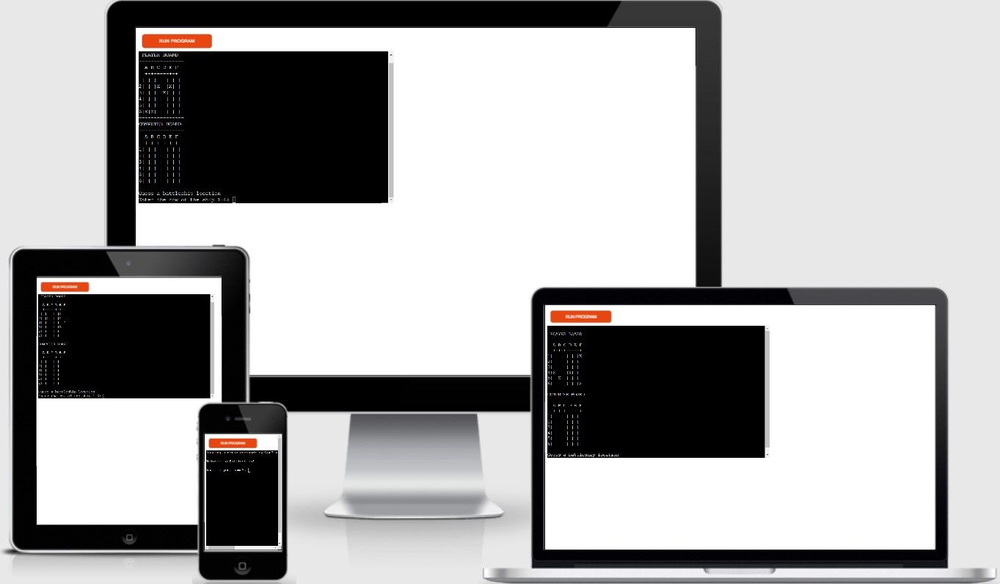

## How the game works

<ol>
<li>As soon as game is loaded it will greet the player and ask for their name.</li>
<li>It will then ask them if they are ready to play and if player enter 'Y' the boards will be loaded and ships positions will be placed for them, on the users board the ships are going to be marked as 'X'</li>
<li>Players will have 10 guesses to hit the computers 5 ships, winner at the end of all the turns is the one with the most hit ships, if the player or computer hit all 5 ships first then they will be the winner.</li>
<li>The question "Guess a battleship location" will appear with "Enter the row of the ship 1-6" input straight after, players will need to put a value between 1-6, after a valid input is put players will need to input a letter between A-F on the "Enter the column of the ship A-F" for another input</li>
<li>After this is done computer will take a guess as well, both locations guessed by the computer and user will be processed, it will return a message stating whether the user hit, missed or guessed already, and will also state whether the computer hit or missed the users ship.
If user already guessed the location the game will not continue until it enters a new location.</li>
<li>After this is done players will be asked if they wish to continue, if 'Y' the board with updated locations will be uploaded, if users enter 'N' then the game will exit instantly and state "GAME OVER"</li>
<li>When game continues the new board will be loaded with '~' for a missed target by either player, 'X' on the computers board if user hit the computers battleship and a '*' on players board if the computer hit the players board.</li>
<li>User will need to guess a new location and this process will be repeated until player or computer hits all ships first, or if they run out of turns the player with the highest hit ship count will win!</li>
<li>Game will state the winner and exit the game</li>
</ol>

## Features

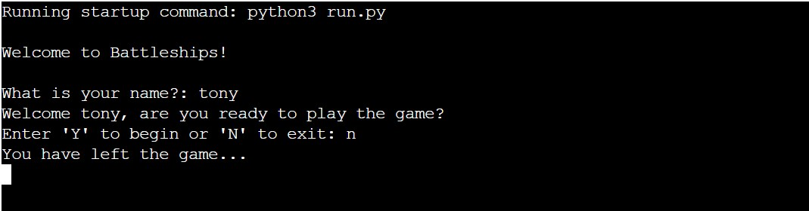

In this part of the game it will welcome the player to the game and ask for their name, and then will ask the player if they are ready to play, when they say 'Y' a board will be generated with 5 ships placed in random locations

If user selects no it will exit the game with a message

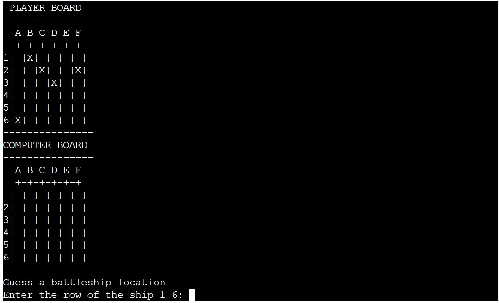

In the image above is how the the terminal is going to look for the majority of the game, the 'X' marks the users ships placed on their board, and the computer board is blank as we are going to try and guess those locations

Right below the two boards the game is requesting a row, in a number, and a column in a character to get the location of the players guess on where the computers ships are hidden

 <h2>More Features of the game</h2> 

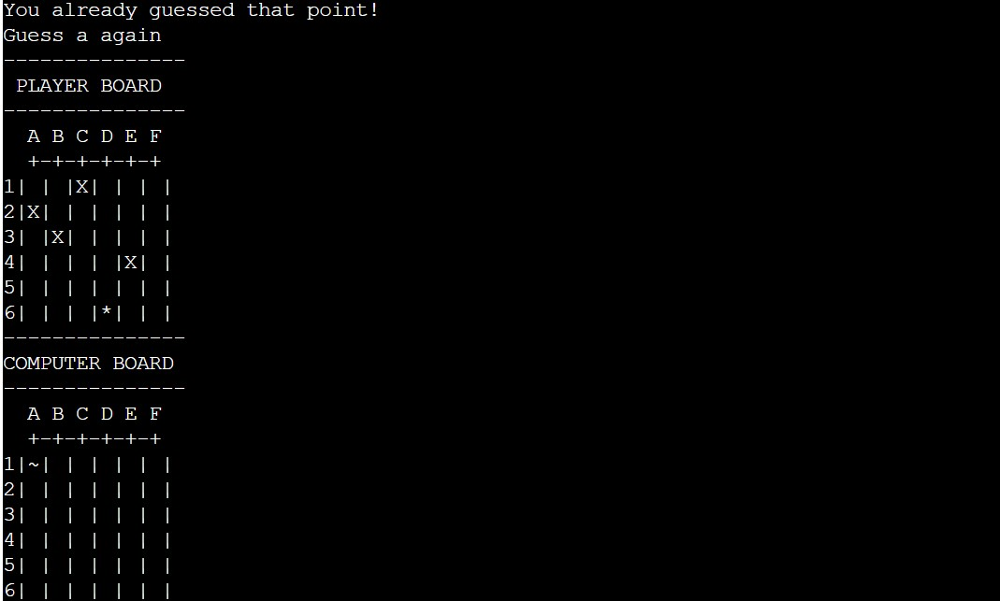

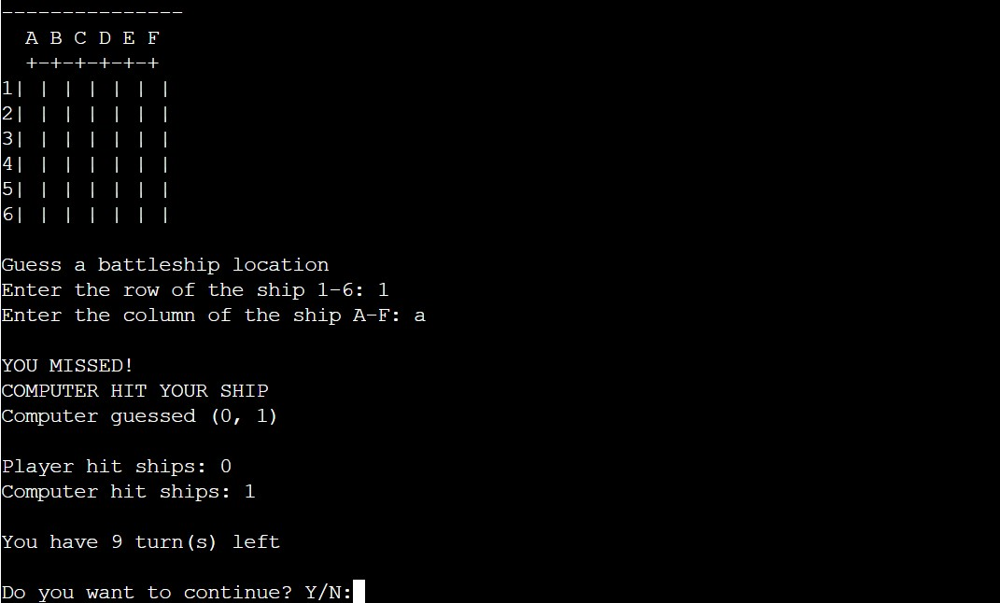

## Input validation and Error messages

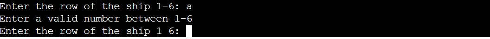

On the image above the game will not go on unless an integer is put in

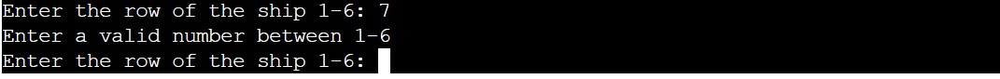

If the player guesses a number out of range then the same thing will happen as above, player will be asked to put a valid input

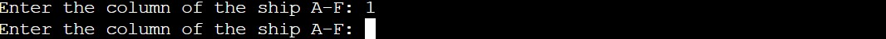

On the image above is an image of the game asking the player to enter a valid character to be able to find the position

## Game updates and NEW ship placement

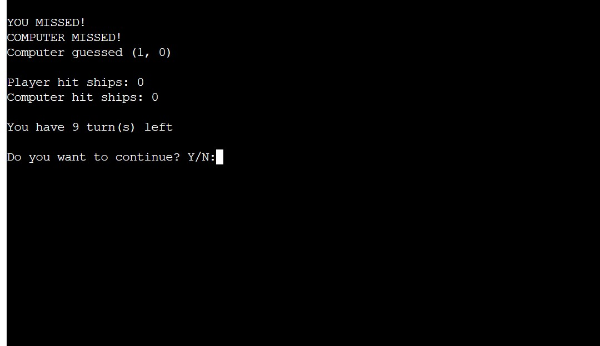

<ul>
<li>When user puts their guess through the computer, it will see if the player hit a ship, the computer will guess as well and will check if their guess hit our ship.</li>
<li>We will also update users with how many turns they have left for the game.</li>
<li>The game will ask players if they wish to continue, if the select 'Y', the update board will be printed and we will ask for their new guess.</li>
<li>If the player says 'N' then the game will shut down</li>
</ul>

<ul>
<li>Updated board is now printed, '*' on players board marks a computer hitting the players ships, the '~' on both player and computer board will mark misses. The 'X' on the computers board is marking a HIT for the player</li>
</ul>

## Game outcome

<ul>

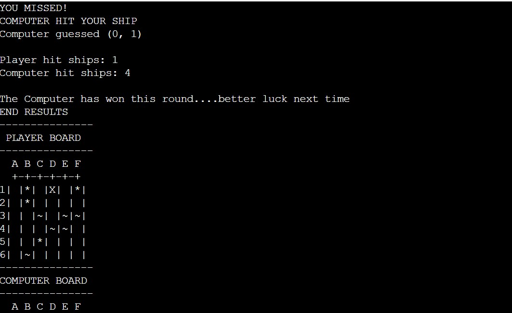

<li>In this outcome when both players have run out of turns it will compare the number of ships each player hit, player with the higher hit ship count wins, in this instance the computer won, if the user has a higher hit count then the message "Congratulations, you beat the computer!" will be diplayed and the game will end.</li>
<li>The game will show the number of hit ships for the player and computer and will print out the final board of all the hit ships and missed ships like the picture below.</li>

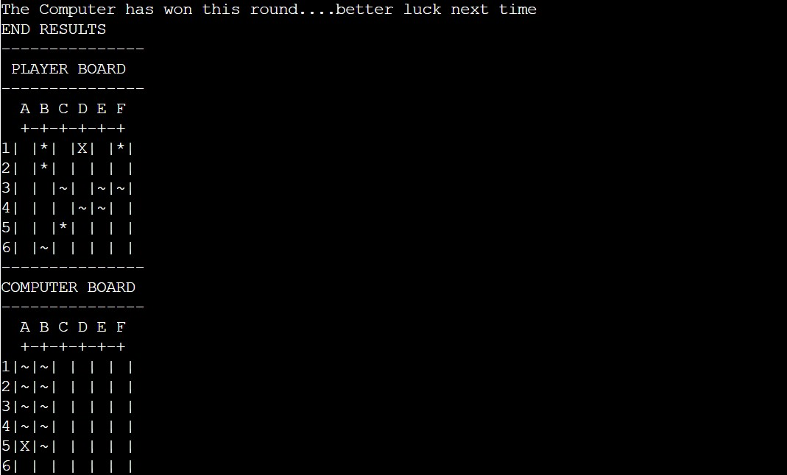

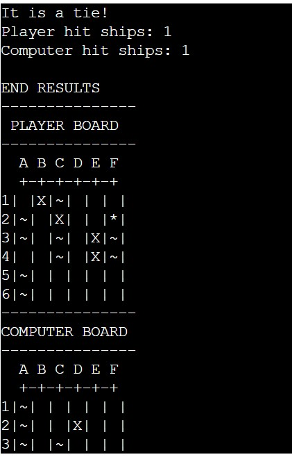
<li>If both players have the same scores then it will be a tie, game will end.</li>
<li></li>

<li></li>
<li></li>

</ul>

## Future goals

Add the end of the game reveal computers ships

