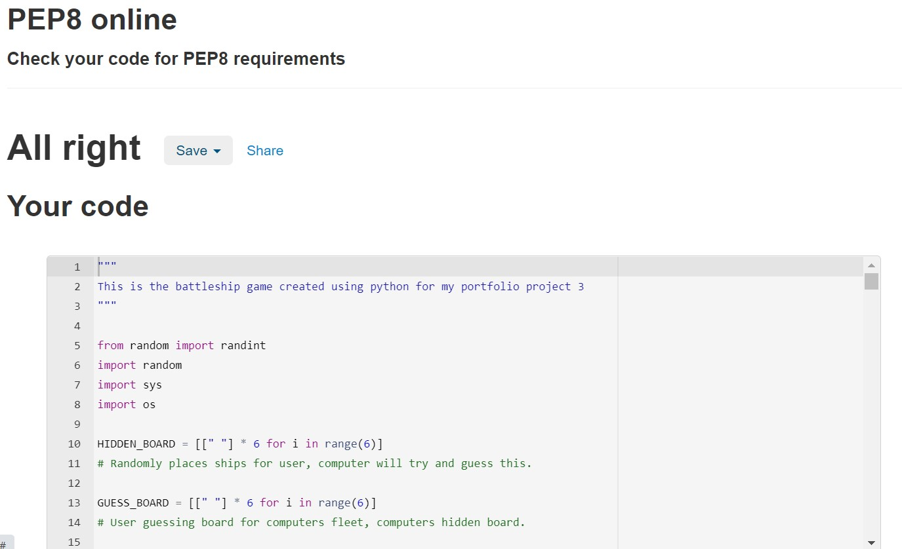

# BATTLESHIPS

BATTLESHIPS is a terminal game created using Python and deployed on Heroku

This is a very basic version of the actual game, 1 ship takes up 1 point of the board, user will play against the computer, scores will be tracked for the user and a winner is decided when all ships are hit or if user and computer run out of turns.

[Live Link of my website](https://antonio-battleships.herokuapp.com/)

## How the game works

<ol>
<li>As soon as game is loaded it will greet the player and ask for their name.</li>
<li>It will then ask them if they are ready to play and if player enter 'Y' the boards will be loaded and ships positions will be placed for them, on the users board the ships are going to be marked as 'X'</li>
<li>Players will have 10 guesses to hit the computers 5 ships, winner at the end of all the turns is the one with the most hit ships, if the player or computer hit all 5 ships first then they will be the winner.</li>
<li>The question "Guess a battleship location" will appear with "Enter the row of the ship 1-6" input straight after, players will need to put a value between 1-6, after a valid input is put players will need to input a letter between A-F on the "Enter the column of the ship A-F" for another input</li>
<li>After this is done computer will take a guess as well, both locations guessed by the computer and user will be processed, it will return a message stating whether the user hit, missed or guessed already, and will also state whether the computer hit or missed the users ship.
If user already guessed the location the game will not continue until it enters a new location.</li>
<li>After this is done players will be asked if they wish to continue, if 'Y' the board with updated locations will be uploaded, if users enter 'N' then the game will exit instantly and state "GAME OVER"</li>
<li>When game continues the new board will be loaded with '~' for a missed target by either player, 'X' on the computers board if user hit the computers battleship and a '*' on players board if the computer hit the players board.</li>
<li>User will need to guess a new location and this process will be repeated until player or computer hits all ships first, or if they run out of turns the player with the highest hit ship count will win!</li>
<li>Game will state the winner and exit the game</li>
</ol>

## Features

In this part of the game it will welcome the player to the game and ask for their name, and then will ask the player if they are ready to play, when they say 'Y' a board will be generated with 5 ships placed in random locations

If user selects no it will exit the game with a message

In the image above is how the the terminal is going to look for the majority of the game, the 'X' marks the users ships placed on their board, and the computer board is blank as we are going to try and guess those locations

Right below the two boards the game is requesting a row, in a number, and a column in a character to get the location of the players guess on where the computers ships are hidden

 <h2>More Features of the game</h2> 

## Input validation and Error messages

On the image above the game will not go on unless an integer is put in

If the player guesses a number out of range then the same thing will happen as above, player will be asked to put a valid input

On the image above is an image of the game asking the player to enter a valid character to be able to find the position

## Game updates and NEW ship placement

<ul>
<li>When user puts their guess through the computer, it will see if the player hit a ship, the computer will guess as well and will check if their guess hit our ship.</li>
<li>We will also update users with how many turns they have left for the game.</li>
<li>The game will ask players if they wish to continue, if the select 'Y', the update board will be printed and we will ask for their new guess.</li>
<li>If the player says 'N' then the game will shut down</li>
</ul>

<ul>
<li>Updated board is now printed, '*' on players board marks a computer hitting the players ships, the '~' on both player and computer board will mark misses. The 'X' on the computers board is marking a HIT for the player</li>
</ul>

## Game outcome

<ul>

<li>In this outcome when both players have run out of turns it will compare the number of ships each player hit, player with the higher hit ship count wins, in this instance the computer won, if the user has a higher hit count then the message "Congratulations, you beat the computer!" will be diplayed and the game will end.</li>
<li>The game will show the number of hit ships for the player and computer and will print out the final board of all the hit ships and missed ships like the picture below.</li>

<li>If both players have the same scores then it will be a tie, game will end.</li>

</ul>

## Data Model

For this game I created 3 boards, a hidden board from the user, which will be the computers board which also has the locations of the computer ships. A guess board for the player, where they can put their guesses which will be compared against the hidden board. The computer hidden board will be the players board, this will show the player their ships as soon as the board is loaded, computer guesses will be compared against this board to see if the hit or miss.

Board will be 6x6, row 1-6 and column A-F. For each 'X' on the players board that a computer guesses the score of the computer will increment by 1 and turns will decrement by 1 and the player ship will turn to a '*'. If the hidden boards location that players guessed has an 'X', the player guess board will place an 'X' on the location.

Boards will be printed after every update, the function place_ships() will place the 'X' randomly for player and computer. user_guess() function will validate users inpute/guess to make sure correct values are inputed. The computer_guess() function will return the computers guess.
The function count_hit_ships(board) will count the number of hit ships for the board that has been passed through

The win_lose_or_tie(player_ship_count, computer_ship_count, turns) function is called when either player/computer hits all of the opponents ships OR both player and computer run out of turns.
This will decide the winner and announce it at the end, while also printing out the final board

## Testing

<ul>
<li>Tested my code using a PEP8 linter and I got several warnings for my code, and after going through my code and fixing these warnings I passed my code through the PEP8 linter again and got no warnings.</li>

</ul>

### Bugs

<ul>Solved bugs
<li>The inputs were a big issue, because user has to enter a Y or N to continue with the game, but when users entered nothing it causes the game to break and through errors, I sorted this out by my code throuing an error message to enter a valid input, and call the use_inputs() function again so it goes over and over until they choose a valid input</li>
<li>Another bug was calling the continue_game() function, it was not working close to the end of the project, and it ended up just being an indentation problem and that got sorted out.</li>
</ul>

<ul>Unsolved bugs
<li>The one bug that really challanged me and burned up a lot of my time was this bug here in the image below, after the player guesses, we ask them if they want to continue and this is suppose to wipe the previous boards, information and load up the new updated boards. But when I deployed my game on the heroku app it seemed the print out the "PLAYER BOARD" the same amount of turns I had. On the gitpod terminal it did not have this issue, after trying to debug my code I tried gettin help and we think it is an issue with the code istitue template. </li>

</ul>

### Validator testing

<ul><li>No warning errors from PEP8online.com</li></ul>

## Libraries

<ul>
<li>random</li>

Random library was used so that randint()could generate a number between 0-5 for the computer to guess player ship locations

<li>os</li>
The 'os' library was used so that the os.system('clear') is used to be able to clear the terminal when loading the new board and get updates for the player whether they HIT or MISSED computer ships and if they won or lost.
<li>sys</li>
The 'sys' library was used to use the sys.exit() for when the game is over, or if player quite the game.
</ul>

## Deployment

<ul>How the project was deployed
<li>Go to the Heroku app and create and account and/or create new app.</li>
<li>Set the buildpacks to Python and THEN Node.JS</li>
<li>Go to 'configure var' on the settings option and set KEY: PORT AND VALUE: 8000</li>
<li>Go to 'deploy' on the Heroku app and link the Heroku app to your GitHub </li>
<li>Select your repository that you want, and branch if you have more then one, if not then (main) will be fine</li>
<li>You can choose either automatic or manual deploy and select 'Delpoy Branch'</li>
</ul>

## Credits and Acknowledgments 

<ul>
<li>Big mention to my mentor Narender Singh with this project, helped me as much as he could with my problems I had</li>
<li>YouTube, stack overflow, codeacademy and knowledge mavens to inspire with ideas and how to handle errors and validation,  and for generating the board that was used for this game.</li>
<li>Code institue for allowing me to use the template and being able to deploy it on the Heroku App.</li>
</ul>

## Future goals and Self improvements

Add the end of the game reveal computers ships.
Store users name and score and create a leaderboard
Start having bigger ships, take up more positions, and score higher points for bigger ships.
My goal was to get this game to work for the player, my code is very messy and needs refactoring and naming my functions and variable needs improvement, I will work on projects on my on time just to get more practice on organising my code and having better names so it is easy to understand.

